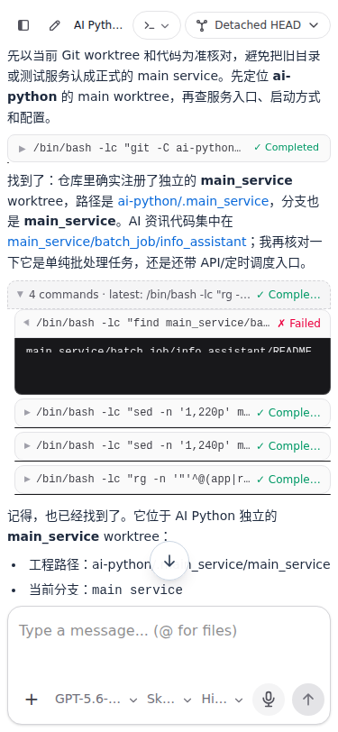
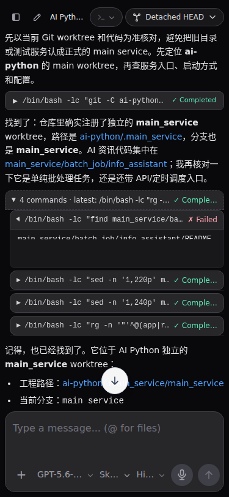
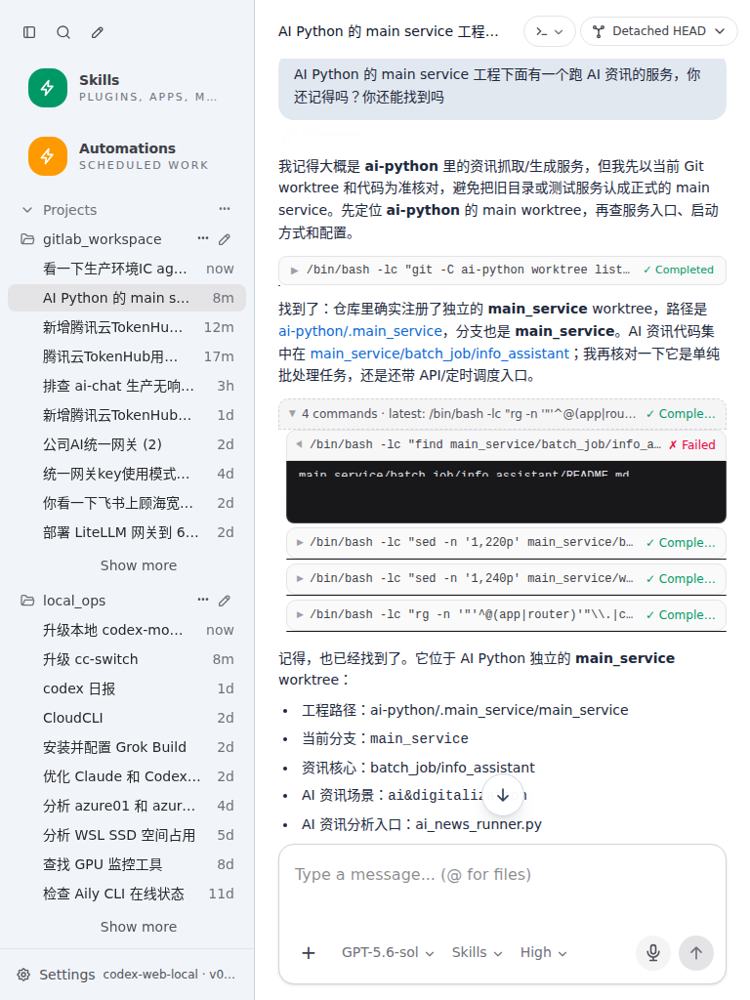
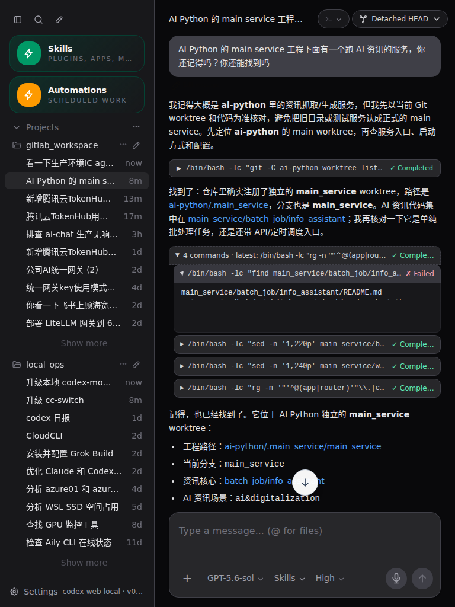

### Feature: Mobile long-thread focus and submit performance

#### Prerequisites

- Run the app from this repository and test both `375x812` and `768x1024` viewports.
- Open a thread whose recent 50-message render window contains several completed command executions, including at least one output larger than 100 KB.

#### Steps

1. Leave all completed command rows collapsed and inspect the page DOM.
2. Confirm collapsed rows have no `.cmd-output-inner` or `.cmd-output` descendants.
3. Tap the composer, type a short message, and submit it.
4. Confirm the keyboard opens and closes without a multi-second pause and the conversation follows the latest message.
5. Expand a completed command row and confirm its full output appears.
6. Collapse the row and confirm its output nodes are removed from the DOM again.
7. Repeat steps 1–6 in light and dark themes at both required viewport sizes.
8. Retain screenshots as `output/playwright/mobile-viewport-375x812-light.png`, `output/playwright/mobile-viewport-375x812-dark.png`, `output/playwright/mobile-viewport-768x1024-light.png`, and `output/playwright/mobile-viewport-768x1024-dark.png`.

#### Expected Results

- Collapsed command output text does not remain in the rendered DOM.
- Tapping and submitting remain responsive even when the underlying thread contains large command outputs.
- A mobile submission requests one explicit jump to the latest message; the conversation's existing bottom lock follows subsequent render frames.
- Expanded command output remains readable and scrollable, with the same light and dark theme styling.
- The four retained screenshots show the tested conversation and composer at both required viewport sizes and themes.

#### Latest Browser Evidence (2026-09-27)

- Tested URL: `http://127.0.0.1:5900/#/thread/01a0b451-366c-7e22-8515-f50cf0cb8202`.
- At `375x812` and `768x1024` in both themes, the collapsed output nodes were absent, a 615,472-character output appeared after expansion and was removed after collapse, submission followed the latest message, and no browser long task was observed.
- Local artifacts: `/home/mjzcng/local_ops/codex-mobile-mobile-performance/output/playwright/mobile-viewport-375x812-light.png`, `/home/mjzcng/local_ops/codex-mobile-mobile-performance/output/playwright/mobile-viewport-375x812-dark.png`, `/home/mjzcng/local_ops/codex-mobile-mobile-performance/output/playwright/mobile-viewport-768x1024-light.png`, and `/home/mjzcng/local_ops/codex-mobile-mobile-performance/output/playwright/mobile-viewport-768x1024-dark.png`.

#### Rollback/Cleanup

- No persistent test data is required. Delete any test message if it was sent to a disposable thread.
